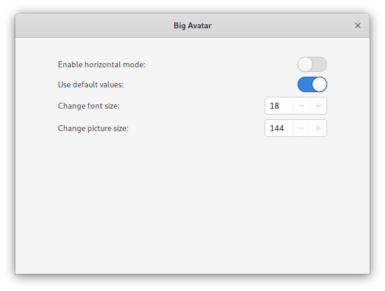
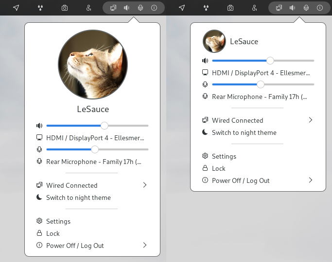

# Avatar Gnome Shell Extension

An extension based on https://github.com/GustavoPeredo/Big-Avatar-Gnome-Shell-Extension with continued support of GNOME Shell 3.38.
I'll update this extension until GNOME Shell 4x+ is ironed out.

Screenshots feature [AdwMod](https://gitlab.com/hrdwrrsk/AdwMod-theme) gtk theme and [Newaita](https://github.com/SaucySauce/ctlos-newaita) icon theme.
